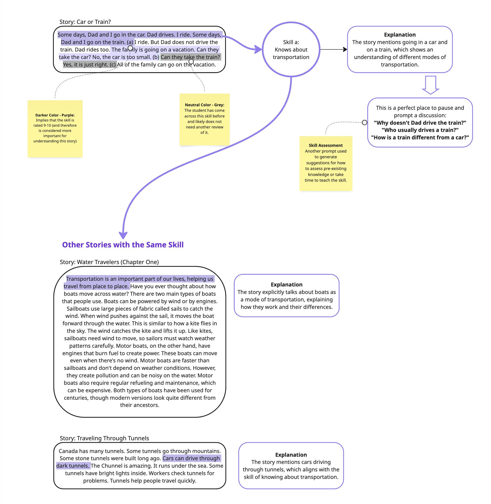

# 📚 Educational Intervention Skill Tagging

## Overview

This application analyzes educational text passages to identify optimal intervention points by mapping content to specific academic skills. It uses large language models (LLMs) to intelligently detect, rate, and explain skill alignment—helping educators personalize instruction and improve learning outcomes.

---

## Sample Output



See full output here: **[output/combined_data_final.xlsx](output/combined_data_final.xlsx)**
---

## 🧠 System Design & Methodology

### 🧩 1. Skill-Based Analysis Framework

- Uses a comprehensive taxonomy of **69 educational competencies**
- Skills span a wide range of domains:
  - **Science** (e.g., life sciences, physics, earth science)
  - **Social Studies** (e.g., history, geography, civics)
  - **Language Arts**
  - **Mathematics**
  - **Arts & Physical Education**
  - **Digital Literacy**

---

### 🤖 2. AI-Powered Skill Assessment

- Powered by **Groq LLM API (llama3-70b-8192)**
- Uses structured prompt templates to ensure consistency
- **Low temperature (0.01)** for deterministic, repeatable outputs

Each model response includes:
- Identified **skill tag(s)**
- **Alignment rating** (scale of 0–10)
- Pedagogical **explanation**
- Highlighted **text excerpt** supporting the alignment

---

### 🎯 3. Intervention Point Detection

The system pinpoints passages that:
- **Strongly align** with specific skills (ratings: 9–10)
- Show **partial alignment** or emerging understanding (ratings: 5–6)
- Offer opportunities for teacher-led **discussion or review**
- **Map multiple skills** to the same passage when relevant

---

## 🛠️ Technical Implementation

- Python-based processing pipeline
- Structured prompt engineering - JSON Output
- LLM output stored and analyzed using DataFrames
- Embedding-based dataset joins to reduce hallucinations
- Final output: Excel reports for easy review & collaboration

### ▶️ How to Run

1. Sign up at [Groq](https://groq.com) and obtain a free API key.
2. Set up the virtual environment:

   ```bash
   pip install -r requirements.txt
   ```

3. Run the story processing script:

   ```bash
   python run_01_process_stories.py
   ```

4. Generate the final AI output:

   ```bash
   python run_02_combine_data.py
   ```

Output: **combined_data_final.xlsx**

---

## 🧪 Human Review & Quality Control

### 🧷 Feedback-Informed Few-Shot Learning
- Create a reference dataset with human-reviewed examples.
- Use these examples as few-shot prompts to guide and improve LLM output quality.

### 🔍 Evaluation with Human Ratings
- Randomly sample and review LLM-generated outputs.
- Human raters evaluate skill alignment, clarity, and pedagogical value.

### 🧠 Prompt Optimization & Edge Case Analysis
- Compare human and model ratings to fine-tune prompts.
- Identify skill categories or content formats where the model underperforms.

### 🤖 LLM-as-a-Judge for Scalable Review
- Fine-tune a model to serve as a proxy reviewer.
- Helps reduce reliance on manual reviews for future outputs.

### 🧪 Lightweight A/B Testing
- Run controlled comparisons of LLM-generated interventions.
- Use engagement or comprehension metrics to assess effectiveness.

---

## 📈 Planned Improvements

- [ ] Improve LLM output validation and error handling  
- [ ] Implement a scalable **LLM-as-a-Judge** system for reviews  
- [ ] Add another prompt for skills assessment
- [ ] Add dynamic **text highlighting** based on skill strength  
- [ ] Integrate **student engagement metrics** for optimization  
- [ ] Visualize and track **skill dependencies** across stories  
